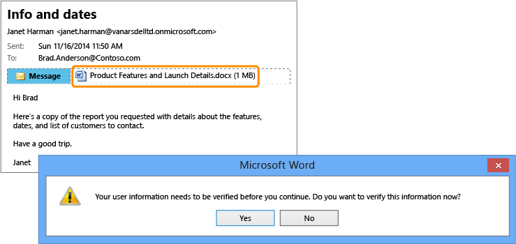

# Full screen picture: Confidential report accidentally sent to wrong person

Back to [Azure RMS in action: Automatically protecting files on file servers running Windows Server and File Classification Infrastructure](http://technet.microsoft.com/library/jj585026.aspx#BKMK_Example_FCI).

