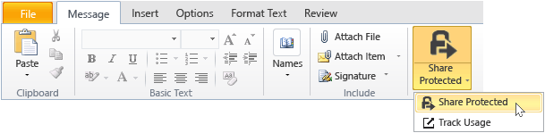
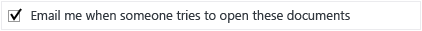

# How to safely share a document by email

## &lt;Instructions for administrators – delete this section before giving to users&gt;
Use this document as a starting point for your own end-user instructions to help users safely share documents by email. Make any modifications that you want to the instructions in the next section, then delete this first section, and give this document to users.

The instructions here are for a fictitious company, **VanArsdel, Ltd**. Before you give these instructions to users, either replace the screenshots and instructions so that they show your own organization name, or modify the instructions to let users know that wherever the instructions refer to VanArsdel, Ltd, they will see their own company name. Other customizations you might want to make:

- In step 2, we suggest just two of the available options if sending to people outside the organization. You might want to change these suggestions.

- In step 2, we suggest descriptions to help users identify which template to select. You might want to change these descriptions to be more specific or meaningful for your business and users.

- In step 3, we suggest **Allow me to instantly revoke access to these documents** for the **Viewer – View Only** option, as an example for when you might want to include this configuration option for users. However, you might decide that users should always select this option whenever they send the document to somebody outside the organization, or never select this option.

- In step 4, we suggest the option **Email me when somebody tries to open this document**. If users track their documents by using the document tracking portal, you might decide that email notification is not necessary and delete this step.

> [!NOTE]
> For more information about each of the options that users can select, see [Dialog box options for the Rights Management sharing application](https://technet.microsoft.com/library/dn574738.aspx)

For the user instructions to work, the following must be in place:

|Check    |Requirement    |If you need more information    |
|---------|---------------|--------------------------------|
|    |You have prepared accounts and groups for Azure Active Directory    |[Preparing for Azure Rights Management](https://technet.microsoft.com/library/jj585029.aspx)    |
|    |Azure Rights Management is activated    |[Activating Azure Rights Management](https://technet.microsoft.com/library/jj658941.aspx)    |
|    |The Rights Management sharing application is deployed to users’ computers that run Windows    |[Automatic deployment for the Microsoft Rights Management sharing application](https://technet.microsoft.com/library/dn339003%28v=ws.10%29.aspx)    |
|    |If you’re using Exchange Server rather than Exchange Online:    <ul><li>The RMS connector is deployed and Exchange Server roles are configured to use it </li> </ul>|[Deploying the Azure Rights Management Connector](https://technet.microsoft.com/library/dn375964.aspx)    |
|    |Users use Outlook from Office 2010.    |If users have Office 2013, replace the screenshots with equivalent versions so that they match what users see.    |
|    |You have configured custom templates as described next    |[Configuring Custom Templates for Azure Rights Management](https://technet.microsoft.com/library/dn642472.aspx)    |

#### To configure the custom templates:

1. Archive the 2 default templates.

2. Create 3 new templates by copying the default templates and making the following changes:

   |Template to copy    |New name    |New description    |Grant these custom rights    |Other settings    |
   |--------------------|------------|-------------------|-----------------------------|------------------|
   |**&lt;organization name&gt; - Confidential View Only**    |**Highly Confidential - &lt;organization name&gt;**    |All users of &lt;organization name&gt; have view and edit rights. No offline access.    |**View Content**    **Save File**    **Edit Content**    |Update the name and description for the languages that users use.    For **content expiration**: Keep the default of **Content never expires**    For **offline access**: Select **Content is available only with an Internet connection**    |
   |**&lt;organization name&gt; - Confidential View Only**    |**Confidential - &lt;organization name&gt;**    |All users of &lt;organization name&gt; have view and edit rights.    |**View Content**    **Save File**    **Edit Content**    |Update the name and description for the languages that users use.    For **content expiration**: Keep the default of **Content never expires**    For **offline access**: Select **Number of days the content is available without an Internet connection** and type **1**    |
   |**&lt;organization name&gt; - Confidential**    |**Internal - &lt;organization name&gt;**    |All users of &lt;organization name&gt; have full rights, but cannot unprotect the content.    |**View Content**    **Save File**    **Edit Content**    **Copy and Extract Content**    **Print**    |Update the name and description for the languages that users use.    For **content expiration**: Keep the default of **Content never expires**    For **offline access**: Keep the default of **Number of days the content is available without an Internet connection** and keep the default value of **7**    |

3. Publish the 3 new templates.

## &lt;User instructions start here, delete this title&gt;
From now on, whenever you send an important document to somebody by email, use these instructions to help prevent the document from being read by people who should not see it.

1. Create your email message by specifying the email address or addresses, type your message, and attach the file that you want to safely share. Then, on the **Message** tab, in the **RMS** group, click **Share Protected** and then click **Share Protected** again:

   

2. In the **share protected** dialog box, specify the following:

   When you send a document to at least one person who works for another organization:

   |If this applies …    |Do this:    |
   |---------------------|------------|
   |**Generic Protection** is automatically selected for you    →    |Keep this selection:        |
   |Information in the document should not be changed    →    |Select **Viewer – View Only**:        |
   |Information in the document can be changed    →    |Select **Co-Author – View, Edit, Copy and Print**:        |
   When you send a document to people inside your organization:

   |If this applies …    |Do this:    |
   |---------------------|------------|
   |**Generic Protection** is automatically selected for you    →    |Keep this selection:        |
   |Information in the document is very sensitive and would cause exceptionally high damage to the organization or to its employees if publicly available    →    |Select **Highly Confidential - VanArsdel, Ltd**:        |
   |Information in the document is  sensitive and would cause damage to the organization or to its employees if publicly available    →    |Select **Confidential - VanArsdel, Ltd**:        |
   |Information in the document should not be shared with people outside your organization but does not contain sensitive information about the organization or its employees    →    |Select **Internal – VanArsdel, Ltd**:        |

3. If you selected **Viewer – View Only**: Select **Allow me to instantly revoke access to these documents**:

   

4. Select **Email me when somebody tries to open these documents**:

   

5. Click **Send Now**:

   

When somebody you’ve sent a protected document to receives the email, they see a message that gives them instructions how to read it. They can read it on many devices, including iPads, iPhones, Android tablets and phones, Mac computers, and Windows computers.

To track whether the people you’ve sent protected documents to have accessed them, use the [document tracking site](https://track.azurerms.com/).

**Need help?**

- For additional information:

   - [Protect a file that you share by email](https://technet.microsoft.com/library/dn574735%28v=ws.10%29.aspx)

   - [Track and revoke your documents](https://technet.microsoft.com/library/dn986611.aspx)

- Contact the help desk:

   - &lt;contact details&gt;

